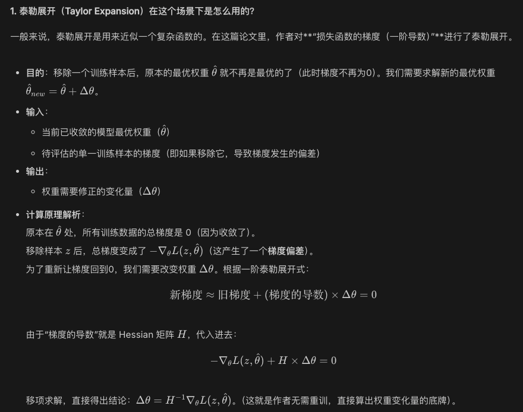
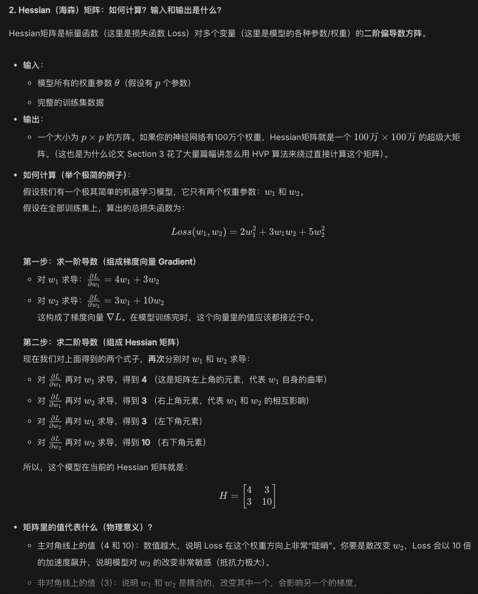
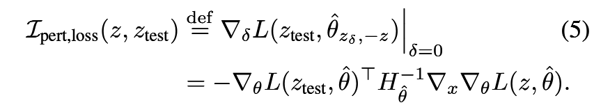

# 1. 文章信息

* 作者/机构：Pang Wei Koh, Percy Liang (Stanford)
- 发表期刊：ICML 2017 Best Paper
- 总结：利用统计学中的影响函数，在无需重新训练模型的情况下，快速估算出一个训练样本对特定测试预测结果的影响力，从而打开深度学习的黑盒。

开创了“基于训练数据的数据归因”领域的先河

# 2. 问题

想知道哪个训练数据最重要，很直觉的做法是每次删掉一个样本重训模型，但这是不现实的。

# 3.创新点与方法 

* 用泰勒展开预判去除某个样本后对模型权重的影响；

* Hessian矩阵计算在当前最优权重下，整体训练数据集损失函数的曲率。它代表了模型权重偏离当前最优值时，整体loss反弹升高的剧烈程度。Hessian矩阵越大（曲率越陡），说明模型对权重的改变越抵抗；Hessian矩阵越小（曲率越平滑），说明权重越容易发生偏移。

* 用hessian矩阵和梯度估算模型参数的变化量：变化量 = 被移除样本的梯度 / Hessian矩阵

* 用链式法则，将模型权重的变化投影到测试样本期望的方向：将权重变化量与测试样本自身的梯度做点乘，就得到了测试损失的变化量。

# 4.如何确定谁最影响结果？

拿影响力得分公式，把训练集里的所有样本挨个代入进去算一遍。算出来的是一个具体的数字：
 
- **如果得分是一个很大的正数**：说明删掉这个训练样本，测试集上的 Loss 会大幅增加（预测变差）。这就意味着，这个训练数据是**高度相关的、极有帮助的好数据**。
- **如果得分是一个很大的负数**：说明删掉这个训练样本，测试集上的 Loss 反而下降了（预测变好）。这就意味着，这个训练数据是一个**帮倒忙的坏数据/错误数据**。
- **如果得分接近 0**：说明删不删这个样本，对当前的测试结果毫无影响（无相关性）。

# 5.理论验证与扩展

传统的“影响函数”理论有着严格的前提假设：

* 模型必须收敛到全局最优点
* 目标函数必须严格凸且二次可导

但深度神经网络通常**非凸、未完全收敛且不可导**。作者证明了该方法在打破假设时依然有效：

- **非凸与未收敛**：如果海森矩阵出现负特征值，作者通过加一个阻尼项强制其正定。实验证明，估算出的影响力和真实重训练的误差依然高度相关。

- **不可导**：对于不可导的损失函数（如 SVM 的 Hinge Loss），作者提出使用平滑的近似函数来专门用于计算影响函数，结果依然极其准确。

# 6.结论与应用场景

1. 理解模型行为：  
	比较了 Inception 网络和 SVM 对同一张图片分类的区别。
	结论：SVM 主要是死板地匹配像素（离测试图片像素越近的训练图影响越大）；而神经网络则能提取高级语义特征，即便是一张完全不像的狗的训练图，也可能对模型认出一条鱼产生巨大的帮助。

2. 生成对抗性训练样本 ：  
	结论：可以在训练集上发动“隐形攻击”。作者找出应该如何微调训练集图片的像素。哪怕肉眼完全看不出训练图被修改过，也能导致模型在特定的测试图上预测彻底翻车。

3. 调试领域不匹配 ：  
	当训练数据分布和测试数据分布不一致时（比如针对不同人群的医疗预测），模型会出错。通过影响函数，作者成功揪出了训练集中导致模型泛化失败的那些“特殊样本”。

4. 修复错误标签：  
	如果在训练集中混入了大量的错误标签（比如标注人员标错了），人类不可能逐一检查。利用影响函数，找出对模型自身影响最大的那些样本进行优先人工检查。
	结论：仅需检查极小部分的训练数据，就能找出绝大多数的错误标签，极大提升了清洗数据的效率。

# 7.局限

1. 局限于“局部/微小”的变化：  
    影响函数的本质是基于参数处的**一阶泰勒展开**来做线性近似。它只能准确估计权重产生“无穷小（infinitesimally-small）”变化时的影响。如果尝试一次性删除整个数据子集（Global changes），或者移除的样本对模型结构有翻天覆地的影响，线性近似就会失效，预估偏差会变得很大。
    
2. 计算开销依然不小：  
    尽管作者使用了 HVP 和随机估计绕开了全矩阵求逆，但对于每一个你想要解释的“测试样本”，都需要跑几千次迭代来估算。在极大规模的深度学习业务中，实时计算影响函数依然不够快。
    
3. 深层神经网络中的理论失效风险：  
    虽然作者通过“加阻尼项”等 trick 使得方法在非凸的神经网络（如文中的 CNN 或冻结了底层特征的 Inception）上 work 了，但在如今参数量动辄几十亿、具有极其复杂 loss 景观的现代大模型中，这种简单的二次凸近似还能保留多少物理意义，是存在争议的。
    
4. 模型参数必须相对稳定：  
    该方法假设在移除点后，模型的参数不会发生剧烈的跳跃（即留在同一个局部最优盆地里）。如果移除某个点导致 SGD 训练时模型走向了另一个完全不同的局部最优解，影响函数给出的预测就会与真实的 Leave-one-out 结果相差甚远。
